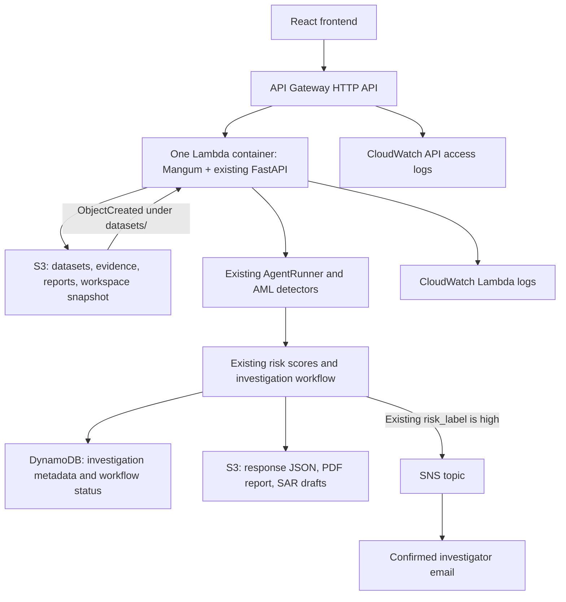

# Anti-Money-Laundering-Detection on AWS — PowerShell deployment guide

This implementation preserves the existing AML algorithms, `AgentRunner`, FastAPI routes,
DuckDB workspaces, investigation queue, audit history, and report generators. AWS mode
adds durable S3 objects, DynamoDB investigation metadata, and real SNS publishing.
Local mode remains available with `AWS_ENABLED=false` (also the code default).

## Architecture and deliberate demo limits



The same Lambda handles API and S3 events. A conditional, expiring DynamoDB lock
serializes each invocation before it restores `state/workspace.duckdb` into
`/tmp/sentinel`, uses the existing application, and checkpoints it back to S3. This
is essential because the current analytical workspaces, alert queue, and audit trail
depend on DuckDB. `/tmp` is a disposable cache, never the source of truth. Do not run
a second AWS-mode writer against the same bucket. During ingestion, API requests can
receive a retryable 503 while the lock is held; wait for completion and refresh the UI.

DynamoDB is the read source for investigation lists/details and stores metadata,
risk summary, status, disposition, assignment, notification status, and S3 pointers.
Full responses (including selected transaction evidence) stay in S3, avoiding
DynamoDB's item-size limit. Queue/audit detail is retained in the S3 workspace.
Paginated Scan is intentional for this small hackathon table.

Dataset metadata under `state/datasets/<dataset_id>.json` retains the exact S3 key,
original filename, content fingerprint, type and upload timestamp. The existing
DuckDB registry continues to supply the frontend's dataset schema and row counts.

The default S3 analysis is a deterministic structuring investigation using the
existing rules, statistical detector, Isolation Forest, and risk scorer, capped at
the existing runner default of 1,000 rows. Graph analysis remains available through
the existing planner for graph-related queries, such as layering/cycles. No detector
or threshold was replaced. The existing high threshold defaults to 0.70, and SNS
uses the engine's resulting `high` label rather than calculating a second score.

Use a small demo database, preferably below 100 MB. Every request transfers the
workspace; this architecture is for a single-user hackathon, not large concurrent
production workloads. Lambda has 3,008 MB RAM, 4 GB temporary storage, and a 900-second
timeout. HTTP API requests still have a 30-second integration limit. S3-triggered
analysis avoids that HTTP limit. Browser uploads are capped at 4 MB to leave room
for Lambda's 6 MB request envelope/base64 encoding. Direct S3 uploads are bounded
by `AWS_MAX_DATASET_BYTES` (50 MB default). Existing CSV/XLSX validation and minimum
row requirements still apply. Larger existing local uploads remain supported locally.
Lambda uses the account's permitted 3,008 MB memory maximum.

This preserves the existing demonstration API's access model; `api.main` does not
enforce analyst authentication on all routes. CORS is not authentication. Use
synthetic demo inputs for this public endpoint. Auth modules elsewhere in the repo
are not silently substituted into the running app by this deployment.

## 1. Prerequisites and local checks

Open PowerShell at the repository root. Install Python 3.12, Node.js, AWS CLI v2,
AWS SAM CLI, and Docker Desktop (Linux containers), if not already installed.

```powershell
$ProjectRoot = 'D:\AWS\AI-Powered-Suspicious-Activity-Detection'
Set-Location $ProjectRoot
aws --version
sam --version
docker version
py -3.12 --version
node --version
npm install --global pnpm

aws configure
# Default region name: ap-south-1
# Default output format: json
aws sts get-caller-identity

$Region = 'ap-south-1'
$Stack = 'sentinel-aml-demo'
$env:AWS_DEFAULT_REGION = $Region
$env:AWS_REGION = $Region

py -3.12 -m venv .venv
.\.venv\Scripts\python.exe -m pip install -r requirements.txt
$env:AWS_ENABLED = 'false'
.\.venv\Scripts\python.exe -m pytest -m 'not requires_data and not integration and not llm and not e2e' -q
```

`aws configure` stores developer credentials in the AWS CLI credential files, never
in this repository. SSO profiles also work: `aws sso login --profile YOUR_PROFILE`,
then set `$env:AWS_PROFILE='YOUR_PROFILE'`. Runtime credentials come from the Lambda
IAM role. The deployer needs permissions to create CloudFormation, IAM roles,
Lambda, ECR, S3, DynamoDB, SNS, API Gateway and log resources; the runtime role is
limited to this stack's bucket/prefixes, table, topic and Lambda log group.

## 2. Build and deploy

Start Docker Desktop first. Use a short lowercase stack name; it is part of the
globally unique bucket name. The account ID and region make collisions unlikely.

The simplest deployment is the checked-in PowerShell script. It validates/builds
SAM, deploys the backend and AWS resources, uploads the existing DuckDB workspace,
builds React with the deployed API URL, and publishes it to the frontend S3 HTTPS endpoint:

```powershell
.\scripts\deploy_aws.ps1
```

Use `-SkipSeed` only after the AWS workspace has already been initialized. The
equivalent manual SAM commands are:

```powershell
sam validate --lint --region $Region
sam build
sam deploy --guided --region $Region
```

Answer the prompts:

- Stack name: `sentinel-aml-demo`
- AWS region: `ap-south-1`
- FrontendOrigin: `http://localhost:5173` for the local React demo, or your exact HTTPS origin
- InvestigationTableName: `SentinelInvestigations` (choose another name if it already exists)
- Allow SAM to create IAM roles: yes
- Allow creation of the image repository: yes, if prompted
- Confirm changes before deploy: yes
- Save arguments to configuration file: yes (`samconfig.toml` is ignored)

If your SAM version asks about unauthenticated endpoints, this is the existing
demo API. For subsequent deployments use `sam build` followed by `sam deploy`.

Retrieve all resource names:

```powershell
$Outputs = (aws cloudformation describe-stacks --stack-name $Stack --region $Region | ConvertFrom-Json).Stacks[0].Outputs
$Api = ($Outputs | Where-Object OutputKey -eq 'ApiUrl').OutputValue
$Bucket = ($Outputs | Where-Object OutputKey -eq 'BucketName').OutputValue
$Table = ($Outputs | Where-Object OutputKey -eq 'TableName').OutputValue
$Topic = ($Outputs | Where-Object OutputKey -eq 'TopicArn').OutputValue
$Function = ($Outputs | Where-Object OutputKey -eq 'FunctionName').OutputValue
$LambdaLogs = ($Outputs | Where-Object OutputKey -eq 'LambdaLogGroup').OutputValue
$ApiLogs = ($Outputs | Where-Object OutputKey -eq 'ApiLogGroup').OutputValue
$FrontendBucket = ($Outputs | Where-Object OutputKey -eq 'FrontendBucketName').OutputValue
$FrontendUrl = ($Outputs | Where-Object OutputKey -eq 'FrontendUrl').OutputValue
$Outputs | Format-Table
Invoke-RestMethod "$Api/health"
```

Expected resources: one private evidence S3 bucket, one public static-website S3
bucket, and their bucket policies; one on-demand
DynamoDB table, one SNS topic, one container Lambda with S3 invocation permission
and async failure destination, one execution role, one HTTP API/default stage,
and two log groups with seven-day retention. SAM also uses deployment artifact
storage and an ECR image repository. The static website is HTTP; an AWS account
verified for CloudFront can add HTTPS/CDN hosting later without changing React.

## 3. Seed the existing analytical baseline

The model needs its knowledge/calibration table. Do this once, before the first
upload, with no API requests or ingestion running. Do not replace the snapshot
after the demo has started; doing so would overwrite workspace and queue history.

Recommended: stop your local API, verify its small existing database, then upload
the closed/checkpointed database. Keep the same DuckDB version as requirements.txt.

```powershell
.\.venv\Scripts\python.exe -c "from pathlib import Path; from scripts.bootstrap_data import verify_database; verify_database(Path('dataset/aml.duckdb'))"
aws s3 cp .\dataset\aml.duckdb "s3://$Bucket/state/workspace.duckdb" --region $Region
Invoke-RestMethod "$Api/ready"
```

If the repository clone does not include private datasets, create a clearly labelled
synthetic demo seed. This uses the existing importers and leaves your main database
alone; it is not a production-calibrated baseline.

```powershell
$env:AWS_ENABLED = 'false'
.\.venv\Scripts\python.exe -m scripts.create_aws_demo
aws s3 cp .\dataset\aws-demo\seed.duckdb "s3://$Bucket/state/workspace.duckdb" --region $Region
Invoke-RestMethod "$Api/ready"
```

The generator refuses to overwrite an existing seed. For another set use
`--output dataset/aws-demo-2`. Generated data is ignored by Git and excluded from
the container. A synthetic high-risk CSV is also generated for the demo below.

`POST /ingest` also works in AWS mode: it reports the restored baseline table
counts, or downloads missing source CSVs from the private bootstrap prefix. To
rebuild from small source files explicitly, upload them and call the existing route:

```powershell
aws s3 cp .\dataset\HI-Small_Trans.csv "s3://$Bucket/state/bootstrap/transactions.csv" --region $Region
aws s3 cp .\dataset\SAML-D.csv "s3://$Bucket/state/bootstrap/knowledge.csv" --region $Region
Invoke-RestMethod -Method Post "$Api/ingest?force=true"
```

For a large baseline, prefer the closed database seed; rebuilding it over HTTP can
exceed API Gateway's request timeout. Bootstrap objects do not trigger analysis.

## 4. Subscribe an investigator email

```powershell
$Email = Read-Host 'Investigator email address'
aws sns subscribe --topic-arn $Topic --protocol email --notification-endpoint $Email --region $Region
aws sns list-subscriptions-by-topic --topic-arn $Topic --region $Region
```

Open the AWS confirmation email and click **Confirm subscription**. Until then,
`SubscriptionArn` is `PendingConfirmation` and alerts are not delivered. The topic
also receives Lambda async failure notifications after retries are exhausted.

An independent delivery smoke test (clearly labelled as a test):

```powershell
aws sns publish --topic-arn $Topic --subject 'Sentinel delivery test' --message 'TEST ONLY - SNS subscription delivery check, not an AML finding.' --region $Region
```

## 5. Upload and run the real AWS flow

For the generated synthetic dataset, upload directly to S3. S3 invokes the Lambda;
the handler fingerprints the actual content and creates the canonical `ds_...` ID.
The path's `demo` segment is an upload label, not the authoritative content ID.

```powershell
aws s3 cp .\dataset\aws-demo\synthetic-transactions.csv "s3://$Bucket/datasets/demo/transactions.csv" --region $Region
aws logs tail $LambdaLogs --since 10m --follow --region $Region
```

Wait for `dataset_ingestion_completed`, then stop log following with Ctrl+C.
The generated dataset has a regression test proving a high-risk result under the
existing engine/default policy. Real datasets may produce other risk levels.

The existing multipart API upload also works for files below 4 MB:

```powershell
curl.exe --fail-with-body -X POST "$Api/datasets/upload" -F "file=@dataset/aws-demo/synthetic-transactions.csv" -F 'display_name=Hackathon transactions' -F 'dataset_type=primary'
```

The upload response confirms validated ingestion and S3 storage, not completion
of asynchronous analysis. Wait for the logs before fetching the new investigation:

```powershell
$Investigations = Invoke-RestMethod "$Api/investigations"
$Investigations | Format-Table investigation_id,dataset_id,status,high_risk_count
$Id = $Investigations[0].investigation_id
$Record = Invoke-RestMethod "$Api/investigations/$Id"
$Record.response.top_entities | Format-Table entity_id,risk_score,risk_label,escalation_action
$Status = Invoke-RestMethod "$Api/investigations/$Id/aws-status"
$Status
if ($Status.report_url) { Invoke-WebRequest $Status.report_url -OutFile .\investigation.pdf }
Invoke-RestMethod "$Api/datasets"
Invoke-RestMethod "$Api/transactions?limit=5"
```

Only `notification_status=sent` means SNS returned a MessageId. It means accepted
by SNS, not confirmed email delivery. `not_required` means no returned entity was
high risk; `failed` means publishing failed. AML results remain available either way.

To retry a failed notification or report without rerunning the AML engine:

```powershell
Invoke-RestMethod -Method Post "$Api/investigations/$Id/retry-aws"
```

`/query` is unchanged. This demonstrates graph selection through the original planner:

```powershell
$Body = @{ query = 'Find layering transaction chains'; dataset_id = $Record.dataset_id } | ConvertTo-Json
Invoke-RestMethod -Method Post "$Api/query" -ContentType 'application/json' -Body $Body
```

If a synchronous query exceeds API Gateway's timeout, Lambda can still complete
and persist it. Check logs and investigation history before resubmitting, to avoid
creating another investigation. Use S3 ingestion for the primary demo analysis.

## 6. Deploy or run React without redesigning it

In the repository-root PowerShell session where `$Api` is set:

```powershell
Set-Location frontend
@"
VITE_API_BASE_URL=$Api
VITE_MAX_UPLOAD_MB=4
"@ | Set-Content -Encoding utf8 .env.local
pnpm install --frozen-lockfile --ignore-scripts
node node_modules/vite/bin/vite.js
```

Open `http://localhost:5173`. Upload a CSV/XLSX, wait for CloudWatch completion, then
open/refresh Investigations to see the actual ID and risk results. No fabricated AWS
status is shown. `VITE_API_BASE_URL` is a build-time variable; rebuild after changing it.

To publish React manually to the S3 website created by this stack:

```powershell
Set-Location $ProjectRoot\frontend
$env:VITE_API_BASE_URL = $Api
$env:VITE_MAX_UPLOAD_MB = '4'
node .\node_modules\typescript\bin\tsc -b
node .\node_modules\vite\bin\vite.js build
aws s3 sync .\dist "s3://$FrontendBucket" --delete --exclude "index.html" --cache-control "public,max-age=31536000,immutable" --region $Region
aws s3 cp .\dist\index.html "s3://$FrontendBucket/index.html" --content-type "text/html" --cache-control "no-cache,no-store,must-revalidate" --region $Region
Write-Host $FrontendUrl
```

The template automatically permits its S3 HTTPS object origin in API and
evidence-bucket CORS. React uses hash routing so nested screens remain directly
refreshable from the S3 object endpoint. `FrontendOrigin` remains available for
an additional local or custom origin.
Do not put AWS credentials or SNS topic permissions in browser code.

The current frontend tests/build do not require the optional `es5-ext` install
script, so the installation command explicitly skips lifecycle scripts. Direct
Node commands also avoid pnpm auto-install checks during development and testing.

## 7. Inspect each service

Return to the repository root. These commands use the resource variables from step 2.

```powershell
aws lambda get-function-configuration --function-name $Function --region $Region
aws lambda get-function-concurrency --function-name $Function --region $Region
aws s3 ls "s3://$Bucket/datasets/" --recursive --region $Region
aws s3 ls "s3://$Bucket/reports/" --recursive --region $Region
aws s3 ls "s3://$Bucket/sar-drafts/" --recursive --region $Region
aws s3 ls "s3://$Bucket/state/ingestion/" --recursive --region $Region
aws dynamodb describe-table --table-name $Table --region $Region
aws dynamodb scan --table-name $Table --projection-expression 'investigation_id,risk_score,risk_level,notification_status' --region $Region
aws sns get-topic-attributes --topic-arn $Topic --region $Region
aws sns list-subscriptions-by-topic --topic-arn $Topic --region $Region
aws logs tail $LambdaLogs --since 30m --region $Region
aws logs tail $ApiLogs --since 30m --region $Region
```

S3 receipts under `state/ingestion/` record completion, invalid input, or failed
attempts. Identical object events reuse the receipt and deterministic investigation
ID. Completed duplicates do not publish again. Standard SNS is at-least-once:
delivery or a crash between publish and recording the MessageId can still duplicate
email; use investigation ID to identify duplicates. Reupload a failed object to
retry its event after correcting configuration. Replace invalid input with corrected
content (new ETag). No transaction/customer records or credentials are deliberately
included in structured operational logs. SNS email contains the requested account
and risk summary, so subscribe only the intended investigator.

## Environment variables

| Variable | Value / purpose |
| --- | --- |
| `AWS_ENABLED` | `true` in Lambda; `false` for existing local persistence |
| `AWS_REGION` | `ap-south-1`; Lambda supplies this reserved variable automatically |
| `AWS_S3_BUCKET` | SAM `BucketName` output |
| `AWS_DYNAMODB_TABLE` | `SentinelInvestigations` or SAM `TableName` output |
| `AWS_SNS_TOPIC_ARN` | SAM `TopicArn` output |
| `ALLOWED_ORIGINS` | Exact React origin; SAM sets it from `FrontendOrigin` |
| `VITE_API_BASE_URL` | SAM `ApiUrl` output, with no `/api` suffix |
| `VITE_MAX_UPLOAD_MB` | `4` for Lambda; existing local UI default is `25` |
| `MAX_UPLOAD_BYTES` | SAM sets 4194304; existing local default is unchanged |
| `AWS_MAX_DATASET_BYTES` | S3 ingestion limit; default 52428800 |
| `DATA_DIR`, `DB_PATH`, `UPLOAD_DIR` | SAM sets writable `/tmp/sentinel` locations |
| `GROQ_API_KEY` | Optional existing local/query capability; automatic S3 demo uses deterministic fallback |
| `LOG_LEVEL` | `info` by default |

Existing risk-policy environment variables remain unchanged. No AWS access key,
secret key or session token is required in application configuration. The root
`.env.example` shows AWS configuration; set `AWS_ENABLED=false` when using it locally.

## Exact tests

```powershell
$env:AWS_ENABLED = 'false'
.\.venv\Scripts\python.exe -m pytest tests/test_aws_services.py tests/test_aws_ingestion.py tests/test_aws_flow.py tests/test_aws_lambda.py -q
.\.venv\Scripts\python.exe -m pytest -m 'not requires_data and not integration and not llm and not e2e' -q
sam validate --lint --region ap-south-1

Set-Location frontend
node node_modules/vitest/vitest.mjs run --maxWorkers=1 --pool=threads
node node_modules/typescript/bin/tsc -b
node node_modules/vite/bin/vite.js build
Set-Location ..
```

With your real governed database installed, run `.\.venv\Scripts\python.exe -m pytest
-m 'not llm and not e2e' -q` on one line. Live server tests additionally require
`RUN_E2E=1` and `SENTINEL_API_URL`; private-data assertions are not replaced with
synthetic data. AWS mocks verify code behavior, not IAM provisioning or actual email
delivery. Deployment and the above service checks are required for live verification.

### Verification performed on this implementation

- Backend: **286 passed**, 41 deselected by the documented private-data/live-service filters.
- Included AWS coverage: **34 tests**, covering CSV/XLSX ingestion, SDK mocks,
  actual Mangum request handling, duplicate events, DynamoDB recovery, SNS failure,
  workflow state, cold restoration, and binary PDF responses.
- Frontend: **29 passed**, TypeScript compilation and Vite production build passed.
- `cfn-lint template.yaml -r ap-south-1` and `git diff --check` passed.
- AWS CLI, SAM CLI and Docker were unavailable in the implementation environment.
  A container image build and live AWS deployment/email delivery have **not** been
  verified. Run the deployment and service checks above in your AWS account.

## Troubleshooting

| Symptom | Check / fix |
| --- | --- |
| AccessDenied | Check `aws sts get-caller-identity`, profile and region. Compare the failing action/resource to the stack role. Do not grant runtime AdministratorAccess. |
| Wrong region / ResourceNotFound | Use `--region ap-south-1` consistently and resource names from this stack's outputs. |
| Bucket-name conflict | Use another short lowercase stack name; do not rename only the bucket while leaving IAM/environment expressions unchanged. |
| Table already exists | Choose an unused `InvestigationTableName`; SAM does not take ownership of an existing local/demo table automatically. |
| Lambda dependencies / import failure | Start Docker in Linux-container mode; build the x86_64 Python 3.12 image with `sam build`. Never copy Windows wheels or `.venv` into the image. |
| Lambda timeout / memory or disk exhaustion | Use smaller demo files and baseline DB; inspect `REPORT` log entries. 900 seconds is the function maximum here. The DynamoDB lock releases on exit and expires after an interrupted invocation. |
| Workspace busy / API 503 | An S3 ingestion or another request owns the DynamoDB workspace lock. Wait briefly and retry; asynchronous S3 events use Lambda retries. |
| API Gateway 502/503 or 429 | Read both log groups. Wait for the serialized ingestion to finish. Confirm Mangum container command and resource permissions. Cold starts/checkpoint transfer also add latency. |
| API Gateway timeout | Synchronous request exceeded 30 seconds. Check history/logs before retrying. Use S3 for analysis orchestration. |
| CORS | Origin must match scheme, hostname and port exactly, with no trailing slash. Update `FrontendOrigin` and redeploy; rebuild React with the correct API URL. |
| DynamoDB write failure | Verify table name, region, GetItem/PutItem/UpdateItem/DeleteItem/Scan permissions. DeleteItem is used only to release the workspace lock. Response evidence is in S3 and local workflow commits are checkpointed; subsequent invocations repair missing metadata. |
| SNS email not received | Check `notification_status`, SNS metrics, spam folder, region and topic ARN. `sent` means publish accepted, not delivery confirmed. |
| SNS subscription pending | Open confirmation email. Re-subscribe if it expired, and verify list-subscriptions shows an ARN instead of PendingConfirmation. |
| Invalid/empty CSV or XLSX | Existing validation requires a mapped schema and sufficient analytical rows (normally 100). Fix the file; do not disable the validators. XLS rather than XLSX is unsupported. |
| Missing knowledge baseline / `/ready` 503 | Seed the existing database with both `transactions` and `saml_knowledge` before analysis. Use the synthetic seed for an isolated demo only. |
| Duplicate upload | AWS reuses the content-derived dataset ID and republishes the object event; completed event receipts prevent repeated analysis/alerts. Local behavior retains its existing duplicate rejection. |
| SNS/report retry needed | Call POST `/investigations/{id}/retry-aws`; already-sent SNS notifications are skipped. |
| S3 event repeatedly fails | Review its receipt and Lambda logs; fix the cause, then reupload. After two retries the async failure is sent to the SNS topic. |

## Cleanup after the hackathon

These commands permanently remove this demo's evidence and resources. Export any
reports you want to keep, stop the frontend/API clients, and use only the bucket
name retrieved from **this stack**. Disable the function before emptying its bucket
so no running ingestion repopulates it. Wait until current work has finished.

```powershell
aws lambda put-function-concurrency --function-name $Function --reserved-concurrent-executions 0 --region $Region
aws s3 rm "s3://$Bucket" --recursive --region $Region
sam delete --stack-name $Stack --region $Region
```

Confirm SAM's prompts, including deletion of its application ECR images/repository
where offered. Check the ECR and S3 consoles for SAM-managed build repositories or
artifact buckets retained/shared by your SAM installation; remove only resources
belonging exclusively to this demo. Do not delete a shared SAM bootstrap stack used
by other projects. The template's table, topic, API, function and log groups have
no retain policy and are removed with the application stack.

## Implementation inventory

Created:

- `api/services/aws/__init__.py`, `settings.py`, `logging.py`, `s3_service.py`, `bootstrap.py`,
  `artifacts.py`, `dynamodb_service.py`, `investigations.py`, `sns_service.py`,
  `completion.py`, `runtime.py`, `errors.py`, `datasets.py`
- `aws/__init__.py`, `aws/lambdas/__init__.py`,
  `aws/lambdas/s3_ingestion/__init__.py`, `aws/lambdas/s3_ingestion/handler.py`
- `lambda_handler.py`, `aws/Dockerfile`, `.dockerignore`, `template.yaml`
- `frontend/.env.aws.example`, `scripts/create_aws_demo.py`, `scripts/deploy_aws.ps1`
- `tests/test_aws_services.py`, `tests/test_aws_ingestion.py`,
  `tests/test_aws_flow.py`, `tests/test_aws_lambda.py`, `AWS_DEPLOYMENT.md`

Modified:

- `api/main.py`: upload storage, retry-safe dataset reuse, structured request logs,
  S3-backed baseline ingestion, export archival, real AWS status/retry endpoints,
  and export aliases matching the existing frontend
- `tools/workflow_store.py`: selectable investigation persistence and workflow synchronization
- `requirements.txt`: boto3 and Mangum
- `.env.example`, `.gitignore`, `frontend/.gitignore`: configuration and artifact exclusions
- `frontend/src/api.ts`: normalize a trailing slash in configured API URL
- `frontend/src/components/UploadModal.tsx`: configurable deployment upload limit

No detection, scoring, feature-engineering, graph, statistical or ML algorithm files
are changed. Existing generated report formats and API response schemas are retained.

AWS references: [Lambda quotas](https://docs.aws.amazon.com/lambda/latest/dg/gettingstarted-limits.html),
[HTTP API quotas](https://docs.aws.amazon.com/apigateway/latest/developerguide/http-api-quotas.html),
[SAM S3 events](https://docs.aws.amazon.com/serverless-application-model/latest/developerguide/sam-property-function-s3.html).
