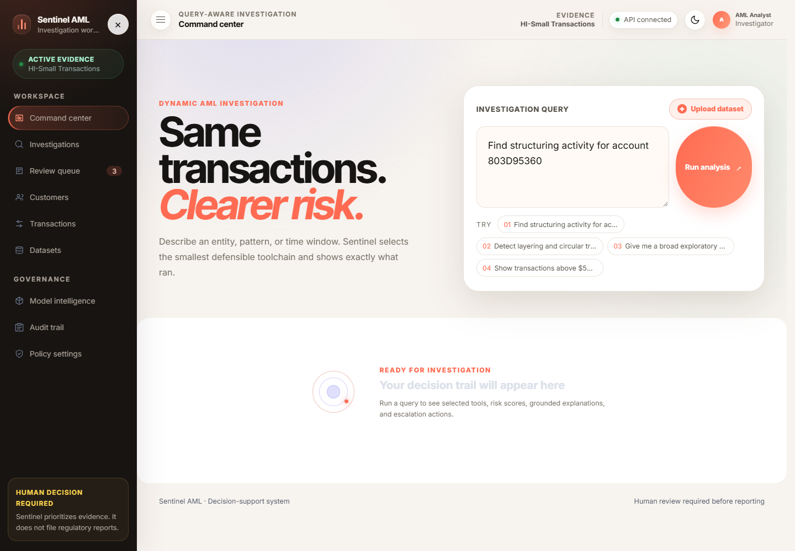
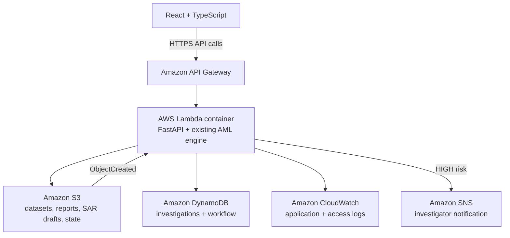
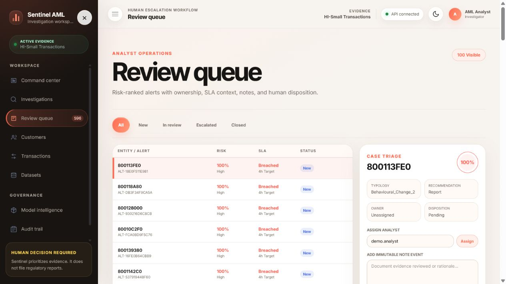
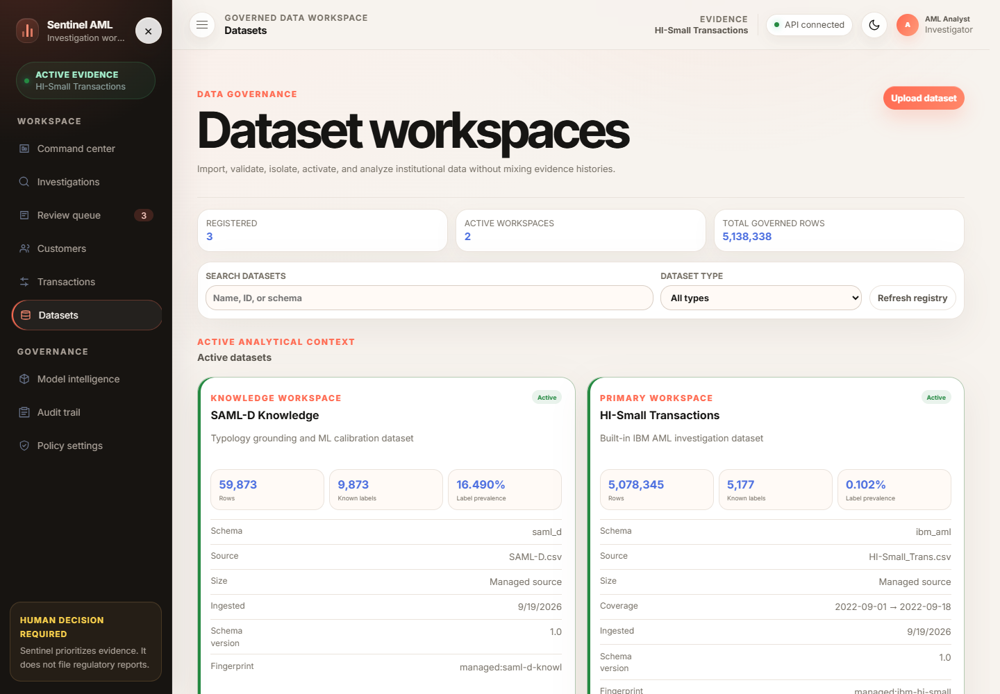
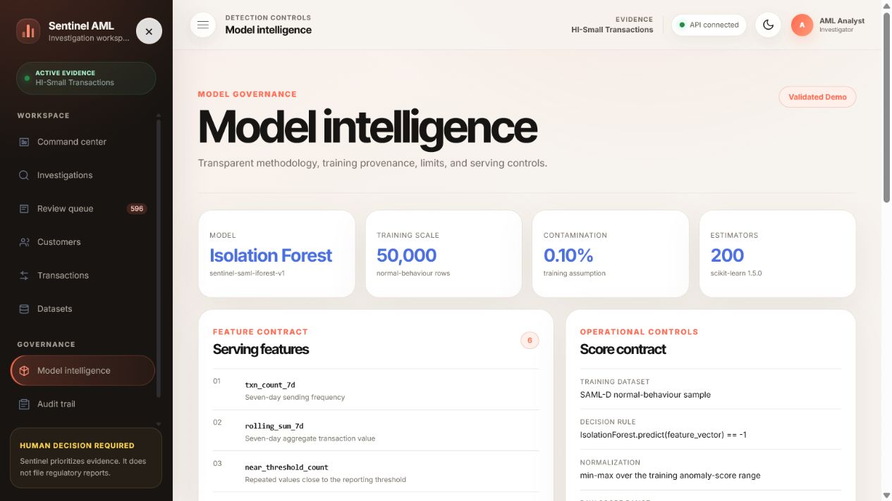
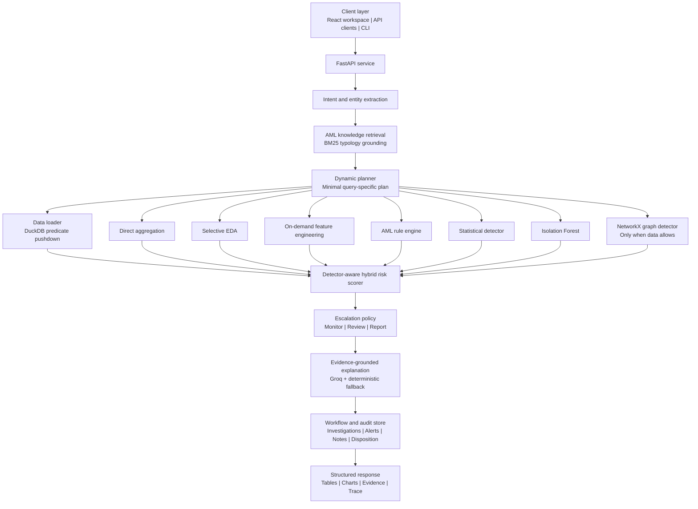
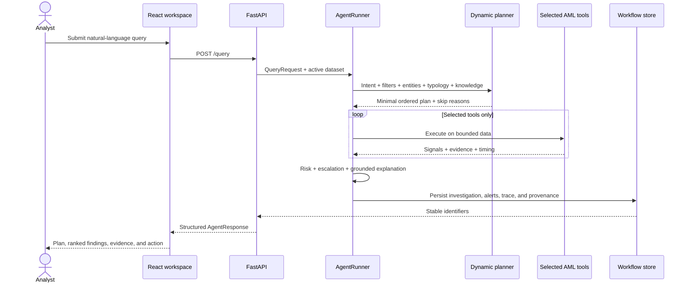
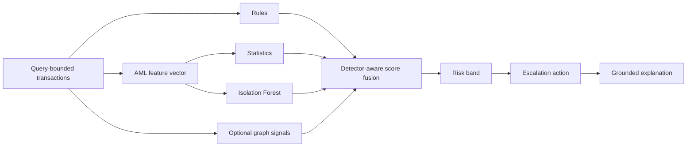

<div align="center">

# Anti-Money-Laundering-Detection

### Sentinel AML — Ask the data. Trace every decision.

An agentic AML investigation workspace that converts a natural-language question into a query-specific analytical plan, invokes only the tools that are needed, and returns explainable risk with an auditable human-review workflow.

[](frontend/)
[](frontend/)
[](api/)
[](https://github.com/Mayank2142/Anti-Money-Laundering-Detection/blob/main/requirements.txt)
[](AWS_DEPLOYMENT.md)
[](tools/)
[](https://groq.com/)
[](#aml-detection-strategy)

**Natural-language intent | Dynamic planning | Hybrid detection | Explainable risk | Human escalation | Immutable trace**

</div>

> [!IMPORTANT]
> Sentinel is a compliance decision-support system. It prioritizes evidence and can produce review-ready material, but it does not autonomously file a SAR/STR or make a final regulatory decision.

---

## At a glance

| Capability | Implementation |
| --- | --- |
| Governed analytical scale | 5.1M+ rows across operational and knowledge workspaces |
| Selective agent tools | Loader, aggregation, EDA, features, rules, statistics, ML, graph, risk, escalation, explanation |
| AML detection | Structuring, smurfing, velocity, rapid movement, amount deviation, fan-in/fan-out, network patterns |
| Model | Isolation Forest trained on a normal-behavior SAML-D sample |
| Natural-language layer | Groq models with deterministic fallbacks |
| Reviewer surfaces | Command center, investigations, queue, customers, transactions, datasets, model, audit, policy |
| Governance | Dataset, model, policy, execution, workflow, and evidence provenance |
| Output | Ranked entities, risk band, score, explanation, recommendation, evidence, charts, and trace |

## Live AWS deployment

| Component | AWS service | Live link |
| --- | --- | --- |
| React/TypeScript frontend | Amazon S3 HTTPS endpoint | **[Open the secure application](https://sentinel-aml-demo-frontendbucket-aqfdpzq4srwb.s3.ap-south-1.amazonaws.com/index.html#/)** |
| FastAPI backend | API Gateway + Lambda container | [API base URL](https://r4kba8rio5.execute-api.ap-south-1.amazonaws.com) |
| Interactive API documentation | API Gateway + Lambda | [Swagger UI](https://r4kba8rio5.execute-api.ap-south-1.amazonaws.com/docs) |
| API specification | API Gateway + Lambda | [OpenAPI JSON](https://r4kba8rio5.execute-api.ap-south-1.amazonaws.com/openapi.json) |
| Service health | API Gateway + Lambda | [Health endpoint](https://r4kba8rio5.execute-api.ap-south-1.amazonaws.com/health) |
| Dataset readiness | API Gateway + Lambda | [Readiness endpoint](https://r4kba8rio5.execute-api.ap-south-1.amazonaws.com/ready) |
| Active datasets | API Gateway + Lambda | [Datasets endpoint](https://r4kba8rio5.execute-api.ap-south-1.amazonaws.com/datasets) |

The AWS deployment runs in `ap-south-1` and uses the **HI-Small Transactions**
workspace as its active primary evidence source. The governed workspace contains
5,078,345 HI-Small transactions. SAML-D remains a separate knowledge and model
calibration workspace; it does not replace the active transaction evidence.



### AWS service integration

| AWS service | Project use |
| --- | --- |
| Amazon S3 | Serves the React build over HTTPS and stores datasets, reports, SAR drafts, generated evidence, and the durable DuckDB workspace snapshot |
| Amazon DynamoDB | Stores investigation metadata and workflow state and coordinates the serialized Lambda workspace lock |
| AWS Lambda | Runs the FastAPI application in a container image and processes S3 dataset creation events |
| Amazon API Gateway | Exposes the existing FastAPI routes to the browser with production CORS configuration |
| Amazon CloudWatch | Captures Lambda application logs and structured API Gateway access logs |
| Amazon SNS | Publishes notification attempts after the existing risk engine classifies an investigation as HIGH risk |
| Amazon ECR | Stores the Lambda container image with pandas, NumPy, scikit-learn, DuckDB, and NetworkX |
| AWS SAM / CloudFormation | Creates the buckets, table, topic, API, Lambda function, IAM role, event notification, and log groups |



See [AWS_DEPLOYMENT.md](AWS_DEPLOYMENT.md) for the complete Windows PowerShell
deployment, validation, troubleshooting, and cleanup instructions.

## Product experience

### 1. Query-aware command center


The command center supports broad exploration, typology searches, threshold aggregation, and single-customer review from the same interface. Analysts can also upload CSV/XLSX evidence directly into the governed ingestion workflow.

### 2. Human review queue



Risk-ranked alerts include ownership, SLA state, notes, disposition, typology, evidence, and an explicit recommendation. Human review remains mandatory.

### 3. Governed dataset workspaces



Operational transactions, knowledge/calibration data, and uploaded evidence remain isolated. Each workspace exposes source metadata, schema, fingerprint, ingestion time, row count, label prevalence, and activation state.

### 4. Model intelligence



Model governance is part of the product, not an appendix. Reviewers can inspect training provenance, serving features, scoring controls, model version, and feature drift.

## Problem statement coverage

| Requirement | Sentinel evidence |
| --- | --- |
| Accept a natural-language instruction | Query-first command center and `POST /query` |
| Extract intent, filters, entities, and pattern | Structured intent object is displayed in every investigation |
| Construct a dynamic execution plan | Planner returns ordered steps, selected tools, rationale, and skip reasons |
| Process only relevant data | DuckDB filtering and predicate pushdown before expensive analysis |
| Run EDA selectively | Broad exploration invokes EDA; targeted and direct aggregation queries skip it |
| Create AML features on demand | Frequency, rolling sum, threshold proximity, deviation, velocity, and counterparty features |
| Detect suspicious behavior | Hybrid rules, Z-score/IQR, Isolation Forest, and optional graph detection |
| Classify risk | Low, Medium, and High bands with policy-controlled thresholds |
| Explain each flag | Query-linked reasons derived from actual detector signals and feature values |
| Recommend action | Monitor, Review, or Report |
| Provide structured output | Intent, plan, trace, ranked entities, metrics, evidence, charts, and provenance |
| Support investigator workflow | Persisted investigations, queue assignment, notes, disposition, and immutable audit events |

## What makes the workflow genuinely agentic

Sentinel does not execute a hard-coded `EDA -> features -> model` sequence.

| User request | Extracted objective | Planner behavior |
| --- | --- | --- |
| `Find structuring patterns in the last 30 days` | Pattern search + date filter + structuring | Filter first, create structuring features, invoke relevant detectors, skip full EDA |
| `Which customers made 10+ transactions under $10,000?` | Direct aggregation + count/amount thresholds | Loader + aggregation; ML and EDA are not required |
| `Is customer ID 4521 suspicious?` | Single-entity lookup | Load one entity, compute targeted signals, explain existing or on-demand risk |
| `Analyse this dataset for suspicious activity` | Broad exploration | EDA + features + hybrid detection + ranked findings |
| `Detect circular layering` | Network typology search | Invoke graph analysis only when counterparty data supports it |

Every completed investigation records:

- original query;
- normalized intent and confidence;
- entities, date range, countries, payment types, amounts, and thresholds;
- selected tools and execution order;
- tools skipped and the reason;
- bounded dataset context;
- detector outputs and feature values;
- risk contribution, band, and policy version;
- explanation, evidence citation, and limitation;
- escalation recommendation;
- investigation, alert, model, and dataset identifiers;
- execution duration and analyst workflow events.

## System architecture



## End-to-end agent flow



## AML detection strategy

Sentinel combines complementary methods because known typologies and novel behavior require different forms of evidence.



### Serving feature contract

| Feature | AML meaning |
| --- | --- |
| `txn_count_7d` | Seven-day transaction frequency |
| `rolling_sum_7d` | Seven-day aggregate value |
| `near_threshold_count` | Repeated transactions near a reporting threshold |
| `amount_deviation` | Difference from an account's normal transaction value |
| `velocity_1hr` | One-hour transaction burst intensity |
| `fan_in_count` | Number of distinct inbound counterparties |

Additional contextual features are generated only when relevant: rapid cash-out, fan-out, threshold bands, country exposure, payment format, direction, rolling velocity, and counterparty-network structure.

### Detection components

| Component | Method | Why it exists |
| --- | --- | --- |
| Rule engine | Configurable AML business rules | Finds known patterns with clear policy logic |
| Statistical detector | Z-score and IQR | Measures behavior against account or dataset baselines |
| ML detector | `scikit-learn` Isolation Forest | Finds multivariate anomalies without hard-coding every pattern |
| Graph detector | Directed NetworkX analysis | Finds cycles, gather-scatter, scatter-gather, and concentration |
| Knowledge retriever | Rank-BM25 | Grounds planning and explanations in controlled typology knowledge |

### Model configuration

The validated demonstration model uses:

- algorithm: Isolation Forest;
- training source: SAML-D normal-behavior sample;
- training scale: 50,000 rows;
- estimators: 200;
- contamination assumption: 0.10%;
- feature contract: six versioned serving features;
- score normalization: min-max over the training anomaly-score range;
- drift monitoring: Population Stability Index (PSI).

### Risk scoring

Default detector weights:

| Detector | Weight |
| --- | ---: |
| Rule engine | 40% |
| Statistical detector | 25% |
| ML detector | 35% |

Weights are normalized over detectors that actually ran. A skipped model therefore cannot dilute the final score. A policy-controlled high-risk-country uplift can add `0.10`; the final score is clipped to `[0, 1]`.

| Score | Risk band | Default recommendation |
| --- | --- | --- |
| `< 0.35` | Low | Monitor |
| `0.35 - < 0.70` | Medium | Review |
| `>= 0.70` | High | Report |

Operational action thresholds are independently policy controlled: Monitor below `0.40`, Review from `0.40` to below `0.70`, and Report at `0.70` or above. A confirmed PEP policy signal can override the action to Report.

These values are demonstration defaults, not universal compliance thresholds.

## Explainability that is tied to evidence

The explanation layer receives:

- the original analyst query;
- extracted intent and scope;
- tools that ran and tools that were skipped;
- feature values and detector scores;
- risk contributions and policy decision;
- top transaction evidence;
- controlled AML knowledge citations.

The configured Groq model produces a concise investigator narrative. A numeric validator checks claims against computed evidence. If the model is unavailable or produces an invalid response, deterministic templates provide a safe fallback.

This design prevents a fluent explanation from inventing a signal that the system did not calculate.

## Data design

| Dataset | Role |
| --- | --- |
| **[IBM Transactions for Anti Money Laundering — HI-Small](https://www.kaggle.com/datasets/ealtman2019/ibm-transactions-for-anti-money-laundering-aml/code)** | Operational evidence: accounts, counterparties, direction, time, amount, currency, country, and payment format |
| **[SAML-D: Synthetic Transaction Monitoring Dataset](https://www.kaggle.com/datasets/berkanoztas/synthetic-transaction-monitoring-dataset-aml/data)** | Typology grounding, model calibration, normal-behavior baseline, feature distribution, and validation context |
| **Uploaded CSV/XLSX** | Isolated institutional evidence workspace after schema inspection and fingerprinting |

Important safeguards:

- operational evidence and knowledge/calibration data use separate tables and workspaces;
- source labels remain evaluation metadata and are not presented as system predictions;
- uploaded files are inspected before ingestion;
- schema mapping and file fingerprints are retained;
- activation is explicit;
- existing investigations keep their original dataset snapshot;
- DuckDB applies filters before expensive analysis;
- row limits prevent an unbounded natural-language request from exhausting the service.

The interactive UI accepts CSV/XLSX files up to 25 MB. Larger sources use the controlled batch-ingestion path.

## Technology stack

### Frontend

- React 19
- TypeScript 6
- Vite 8
- React Router 7
- Plotly and `react-plotly.js`
- Responsive CSS design system with light/dark themes
- Accessible navigation and reduced-motion support
- Vitest, Testing Library, and Oxlint

### Backend and analytical data

- Python 3.11+
- FastAPI and Uvicorn
- Pydantic
- DuckDB
- Pandas, NumPy, PyArrow, and SciPy
- CSV and XLSX ingestion
- ReportLab and OpenPyXL exports
- HTTPX, Tenacity, Loguru, and Rich

### AI, ML, retrieval, and graph

- Groq API
- intent model: `openai/gpt-oss-20b`
- explanation model: `openai/gpt-oss-120b`
- fallback model: `qwen/qwen3-27b`
- Isolation Forest with scikit-learn
- Z-score and IQR detection
- configurable AML rules
- NetworkX graph analytics
- Rank-BM25 retrieval

The core analytical path can operate without a Groq key through deterministic intent, planning, and explanation fallbacks.

## API surface

OpenAPI documentation is available at `http://127.0.0.1:8000/docs`.

| Area | Endpoints |
| --- | --- |
| Operations | `GET /health`, `GET /ready`, `POST /ingest` |
| Agent | `POST /query` |
| Data | `GET /stats`, dataset list/inspect/upload/activate/delete routes |
| Evidence | `GET /customers`, `GET /customers/{id}`, `GET /transactions`, payment-format route |
| Investigations | `GET /investigations`, `GET /investigations/{id}` |
| Review workflow | queue list/summary, assign, note, and disposition routes |
| Model governance | `GET /model-card`, `GET /model-card/drift`, `GET /policy` |
| Audit | `GET /audit` |
| Exports | entities, investigation, execution trace, SAR draft, model card, audit, and EDA |

### Example API request

```powershell
$body = @{
  query = "Find structuring patterns between 2022-09-01 and 2022-09-18"
} | ConvertTo-Json

Invoke-RestMethod `
  -Method Post `
  -Uri "http://127.0.0.1:8000/query" `
  -ContentType "application/json" `
  -Body $body
```

## Quick start

### Prerequisites

- Git
- Python 3.11 or 3.12
- Node.js 20.19+ or 22.12+
- npm
- HI-Small and SAML-D files if they are not already present under `dataset/`

### 1. Clone

```powershell
git clone https://github.com/Mayank2142/Anti-Money-Laundering-Detection.git
Set-Location Anti-Money-Laundering-Detection
```

For an existing clone:

```powershell
git pull
```

### 2. Install backend dependencies

Windows PowerShell:

```powershell
python -m venv .venv
.\.venv\Scripts\Activate.ps1
python -m pip install --upgrade pip
pip install -r requirements.txt
```

macOS/Linux:

```bash
python3 -m venv .venv
source .venv/bin/activate
python -m pip install --upgrade pip
pip install -r requirements.txt
```

### 3. Configure the environment

Windows:

```powershell
Copy-Item .env.example .env
```

macOS/Linux:

```bash
cp .env.example .env
```

Set the optional Groq credential:

```dotenv
GROQ_API_KEY=your_groq_api_key
```

Never commit a populated `.env` file.

Expected source paths:

```text
dataset/HI-Small_Trans.csv
dataset/HI-Small_accounts.csv
dataset/SAML-D.csv
```

Initialize the analytical store explicitly:

```powershell
python -m tools.data_loader
```

The API can also perform a non-destructive startup ingest when the DuckDB file is absent.

### 4. Start the API

```powershell
uvicorn api.main:app --reload --host 127.0.0.1 --port 8000
```

Check:

```text
http://127.0.0.1:8000/health
http://127.0.0.1:8000/ready
http://127.0.0.1:8000/docs
```

### 5. Start the analyst workspace

In a second terminal:

```powershell
Set-Location frontend
npm ci
npm run dev -- --host 127.0.0.1
```

Open `http://127.0.0.1:5173`.

The local demonstration workspace does not require a sign-in gate.

## Test and verification

Backend:

```powershell
pytest -q
```

Frontend:

```powershell
Set-Location frontend
npm test
npm run build
npm run lint
```

Recommended end-to-end smoke test:

1. Confirm `/health` and `/ready`.
2. Upload or activate a primary transaction workspace.
3. Run a targeted structuring query and confirm EDA is skipped.
4. Run a direct aggregation query and confirm ML is skipped.
5. Run a broad query and confirm EDA is selected.
6. Inspect the execution trace and skip reasons.
7. Open a flagged entity and verify its transaction evidence.
8. Assign an alert, append a note, and set a disposition.
9. Confirm the audit trail contains the workflow event.
10. Review model provenance and drift.

## Three-query judge demo

This sequence demonstrates adaptiveness in under three minutes.

### Query 1: targeted typology

```text
Find structuring activity for account 803D95360
```

Show:

- extracted account and structuring intent;
- bounded entity loading;
- relevant feature/rule/statistical path;
- skipped EDA with rationale;
- entity risk, evidence, explanation, and action.

### Query 2: direct threshold aggregation

```text
Which customers made 10 or more transactions under $10,000?
```

Show:

- count and amount thresholds;
- aggregation-first plan;
- ML skipped because a deterministic aggregate answers the question;
- ranked matching accounts.

### Query 3: broad autonomous analysis

```text
Analyse this dataset for suspicious activity
```

Show:

- EDA selected because the request is broad;
- on-demand feature engineering;
- hybrid anomaly detection;
- charts, top entities, risk bands, explanations, and escalation.

Finish in the review queue, then show the audit trail and model intelligence page.

## Useful demo queries

```text
Find structuring activity for account 803D95360
Which customers made 10 or more transactions under $10,000?
Is customer ID 4521 suspicious?
Detect layering and circular transfers in the last 30 days
Analyse this dataset for suspicious activity
Show transactions above $500,000
```

## Repository map

```text
.
|-- agent/                 # Intent, planning, knowledge, explanation, and risk
|-- api/                   # FastAPI application, routes, services, repositories
|-- dataset/               # Local governed data and DuckDB artifacts
|-- docs/screenshots/      # Submission screenshots
|-- frontend/              # React + TypeScript analyst workspace
|-- knowledge_base/        # Controlled AML typology material
|-- models/                # Model artifacts and metadata
|-- scripts/               # Bootstrap and operational utilities
|-- tests/                 # Unit, API, agent, and regression tests
|-- tools/                 # Selectively invoked AML analytical tools
|-- ui/                    # Supporting UI/runtime modules
|-- .env.example
|-- requirements.txt
`-- README.md
```

## Evaluation rubric map

| Scoring area | Demonstrable proof |
| --- | --- |
| Agentic architecture and adaptive orchestration | Contrasting queries produce different ordered plans; execution summary shows rationale and skip reasons |
| Minimum functional requirements | Intent, filters, scoped loading, selective EDA, on-demand features, detection, risk, explanation, and action |
| Tool and component quality | Dedicated EDA, feature, rule, statistical, ML, graph, risk, escalation, and explanation components |
| Output and judge friendliness | Ranked findings, risk badges, evidence tables, charts, execution trace, and reviewer workflow |
| AML domain correctness | Structuring, smurfing, threshold behavior, velocity, rapid movement, amount deviation, layering, fan-in/fan-out |
| Demo execution | Three-query script moves from adaptive planning to evidence, escalation, audit, and model governance |
| Differentiation | Hybrid scoring, uncertainty-aware fallbacks, governed uploads, dataset isolation, drift monitoring, and reproducible traces |

## Reliability and edge cases

Sentinel is designed to fail safely:

- empty or incomplete requests return a controlled response;
- unsupported patterns are disclosed rather than silently approximated;
- missing graph fields cause the graph tool to skip with a reason;
- LLM failures use deterministic fallbacks;
- invalid numeric LLM claims are rejected;
- data loading is bounded;
- unsupported upload schemas return validation warnings;
- inactive datasets cannot silently replace active evidence;
- exports are marked as drafts requiring human review;
- historical investigations retain their original provenance.

## Production-readiness roadmap

Before institutional deployment:

- replace demonstration thresholds with compliance-approved segment policies;
- validate recall, precision, false-positive rate, and stability on institution-specific cases;
- add enterprise identity, authorization, secrets management, and network controls;
- encrypt evidence in transit and at rest;
- enforce jurisdictional retention and privacy requirements;
- validate the deployed DynamoDB workflow configuration against the institution's retention and recovery requirements;
- establish model approval, drift review, change control, and rollback;
- add distributed telemetry, service-level monitoring, rate limiting, and load testing;
- document case-management and SAR/STR handoff integrations;
- require qualified investigator approval for all reporting decisions;
- complete legal, security, privacy, model-risk, and regulatory assessments.

## Team

| Team member | Contribution |
| --- | --- |
| **Mayank Gupta** | Mainly worked on the frontend. Built the React/TypeScript dashboard, transaction pages, risk charts, and investigation screens; connected the frontend to the backend; and kept the interface simple and easy to use. |
| **Devesh Singhal** | Mainly worked on AWS and cloud integration. Implemented S3, DynamoDB, Lambda, API Gateway, CloudWatch, and SNS for data storage, serverless processing, API management, monitoring, and high-risk alerts; also supported cloud setup and deployment. |
| **Devesh Raj** | Mainly worked on the backend and AI/ML. Built the FastAPI backend and transaction analysis using AML rules, statistical detection, Isolation Forest, and NetworkX graph analysis; also implemented risk scoring and evidence-based explanations for suspicious activity. |

## Responsible-use statement

Money-laundering labels are sensitive and context dependent. A high score is an investigative lead, not proof of criminal behavior. All outputs must be reviewed by qualified personnel under the institution's approved AML program.

Use source datasets according to their licenses and data-handling requirements. Never commit confidential customer information, production credentials, or regulated evidence to this repository.
